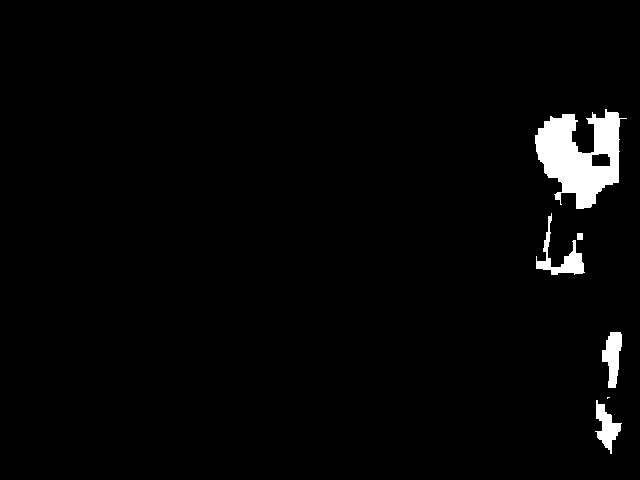
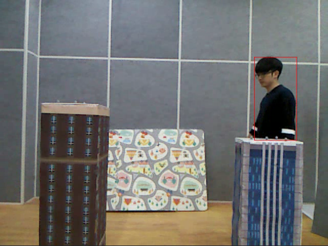

# Unsupervised Object Tracking

This project implements an object tracking system using rough sets and flow graphs.
It processes video input to detect and track moving object across frames.


## Features

🧠 Supervised object tracking using rough set theory and flow graphs
🎥 Support for RGB-D video format
📈 Modular architecture: separate stages for preprocessing, tracking, and postprocessing
🧪 Unit testing
📦 Easy setup with minimal dependency requirements


## Project Structure

  ```text
  object_tracking/
  ├── data/ # Directory for input videos
  ├── models/ # Contains the core implementation of the unsupervised object tracking algorithm, including models based on rough sets and flow graphs.
  ├── preprocessing/ # Scripts for preprocessing input data
  ├── postprocessing/ # Scripts for processing detection outputs
  ├── utils/ # Utility functions and helpers
  ├── results/ # Output results and visualizations
  ├── tests/ # Unit tests for various modules
  ├── main.py # Main script to run the object tracking pipeline
  └── README.md # Project documentation
  ```

## Installation

  ```bash
  git clone https://github.com/kKedaRr3/object_tracking.git
  cd object_tracking
  ```

## How to use?

To track objects, first load your RGB-D video in `main.py` using `load_frames_from_mp4` from the `preprocessing` module, 
then pass the loaded frames to the `object_tracking` function along with the output path, detection `threshold`, and tracking parameter `p`.

## Example results

The tracking result in video format can be found in the `results/man` folder.<br><br>
The examples below are taken from different frames.


1. **Separated moving object**: <br><br>


2. **Detected object**: <br><br>

